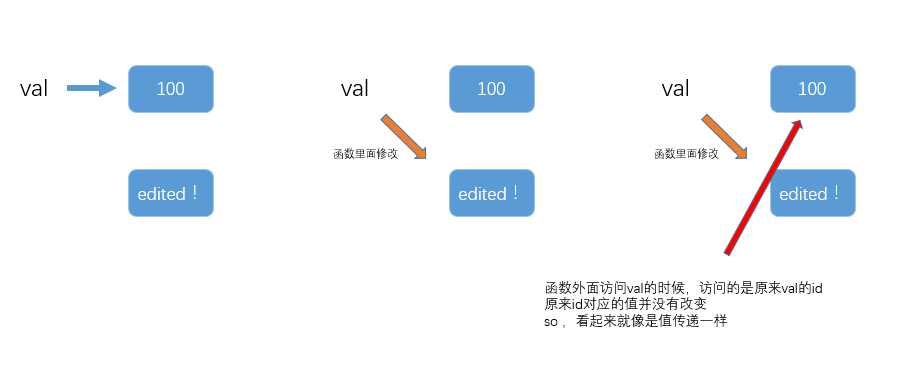

## Python 教程 

#### 1. 生成器和迭代器的区别
        
如果要创建一个100w元素的列表，直接创建出来，放在那里很耗费空间。生成器的想法是，到了需要的时候，再取创建。通过 yield 关键字 可以实现一个生成器的函数，如下所示 :
```
def myrange_func(end):
    i = 0
    while i <end:
        yield i 
        i+=1

In [11]: myrange_func(10)
Out[11]: <generator object myrange_func at 0x000001E51FA30BA0>

In [12]: f = myrange_func(10)

In [14]: next(f)
Out[14]: 0

In [15]: next(f)
Out[15]: 1

In [16]: next(f)
Out[16]: 2

# for - in 的表达式
In [17]: for i in f:
    ...:     print (i)
    ...:
3
4
5
6
7
8
9
```

做一个小练习，写一个生成器版本的斐波那契数列
```
# 生成器的版本
def fib_generate(max):
    n,a,b = 0,0,1
    while n<max:
        yield b 
        a,b = b ,a+b
        n+=1
```


#### 2. 可变对象和不可变对象
C++ 里面函数在参数传递的时候，可以通过定义函数的时候，指明是值传递，还是传递引用or指针。Python里面没有办法这样定义，那问题来了，python的在函数调用的时候，传递的是什么？

做两个测试

**第一个例子：**
在函数外面创建一个int，然后函数里面把它修改，在函数外面在访问一些，看看int有没有改变？

```
In [8]: def test_func(val):   #创建一个函数，在函数里面将参数修改
   ...:     val="edited !"
   ...:

In [9]: val =100

In [10]: test_func(val)

In [11]: val
Out[11]: 100   #这里显示val没有被修改
```
答案是，在函数外面创建的int，在函数里面被修改之后，外面再次访问的时候，int没有改变。
["像c++里面的值传递"]


**第二个例子是：**

在函数外面创建一个list，然后在函数里面把它修改，再在函数外面访问一下，看看list有没有改变。
```
In [12]: def test_func2(mylist):
    ...:     mylist.append('edited !!')

In [13]: mylist=[]

In [14]: test_func2(mylist)

In [15]: mylist
Out[15]: ['edited !!']   #这里显示list已经被修改
```
答案是：在外面的创建的list，在函数里面被修改之后，再外面再次访问的时候，发现list已经被修改了。["相当于c++里面的 引用传递" ]


**解释和分析：**

Python函数传递的既不是值传递，也不是引用传递。而是**叫做call-by-object（传递对象）**。传递来的对象分为两种，一个是可变对象（list，dict），一个是不可变对象（str，int，float）。

如果要修改一个不可变对象，那么它的id会被改变。
```
In [17]: id(val)
Out[17]: 1645698944

In [20]: val =123
In [21]: id(val)
Out[21]: 1645699680
```
如果要修改一个可变对象，它的id不变。
```
In [24]: list1=list(range(10))

In [25]: id(list1)
Out[25]: 2023657465352

In [26]: list1.append('edit!')

In [27]: id(list1)
Out[27]: 2023657465352
```


**对于不可变对象：**

如果在函数外面创建一个不可变对象val = 100 ，在函数里面修改的时候，让val = "edited !" ，函数里面会新的对象"edited !",然后让val指向这个新对象。在函数外面访问的是，依然找的是val原来id对应的值，这个值没有变，所以，对于一个不可变对象，在参数传递的时候就像是值传递一样。如下图所示。




**对于可变对象：**

对于可变对象mylist，函数里面的修改不会改变mylist的id，（会改变mylist里面元素的id）。所以在函数外面访问的时候，mylist的id对应的内容已经被修改。所以，对于一个可变对象，在参数传递的时候就像是引用传递一样。


#### 3. 对象的浅拷贝和深拷贝 ####
```
xiaoming = ['will' , 28,["python","js"]]

#
lilei =xiaoming

#
lilei =xiaoming[:]

#
lilei = copy.copy(xiaoming)  #浅拷贝

#
lilei = copy.deepcopy(xiaoming)  #深拷贝
```


#### 3. new 和 __init__ 魔法函数


#### 4. Python的缺陷